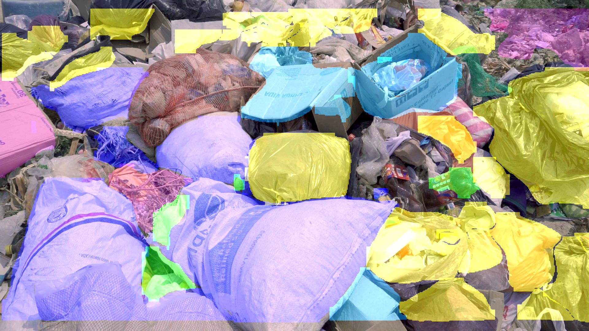

# 🗑️ Abandoned Waste Detection — IEEE Project

> A YOLOv8-powered real-time detection and instance segmentation system that identifies abandoned waste (plastic bags, bottles, cardboard, and more) from video streams and webcam feeds.


<p align="center">
  
  <br/>
  <em>Sample detection output with instance segmentation masks</em>
</p>

---

## 📋 Table of Contents

- [📖 About the Project](#-about-the-project)
- [✨ Features](#-features)
- [🎯 Detected Waste Classes](#-detected-waste-classes)
- [🚀 Getting Started](#-getting-started)
  - [Prerequisites](#prerequisites)
  - [Installation](#installation)
- [🔧 How to Run](#-how-to-run)
- [📂 Project Structure](#-project-structure)
- [🛠️ Technologies Used](#️-technologies-used)
- [🤝 Contributing](#-contributing)
- [📜 License](#-license)
- [🙏 Acknowledgements](#-acknowledgements)
- [👨‍💻 Made and Developed By](#-made-and-developed-by)

---

## 📖 About the Project

Abandoned waste is a growing environmental concern. This project leverages the power of **YOLOv8** to detect and segment waste in real-time from video streams. The system is designed to assist in **waste management** and **environmental monitoring** by providing:

- Frame-by-frame detection with colored segmentation masks
- An interactive Streamlit dashboard for uploading videos and reviewing results
- Automated batch processing via a background scheduler
- Downloadable PDF reports summarizing all detections

---

## ✨ Features

| Feature | Description |
|---------|-------------|
| **Real-Time Video Detection** | Process uploaded video files frame-by-frame to detect and segment waste objects |
| **Live Webcam Detection** | Stream your webcam feed with real-time waste detection overlays |
| **Instance Segmentation** | Pixel-level segmentation masks with class-specific color coding |
| **Interactive Dashboard** | Dark-themed Streamlit dashboard to upload videos, view results, and download reports |
| **Detection Logging** | Per-frame JSON logs with timestamps and detected object classes |
| **PDF Report Generation** | Auto-generate downloadable PDF reports summarizing detection results |
| **Auto-Scheduler** | Background daemon that monitors a watch folder and processes new videos automatically |
| **Waste Class Statistics** | View distribution charts of detected waste categories |

---

## 🎯 Detected Waste Classes

The custom-trained YOLOv8 model identifies the following **5 waste classes**:

| Class | Segmentation Color |
|-------|-------------------|
| 🟠 Cardboard | Orange |
| 🔵 Plastic Bag | Cyan |
| 🟢 Plastic Bottle | Green |
| 🔴 Trash | Red |
| 🟣 Tree | Purple |

---

## 🚀 Getting Started

Follow these instructions to set up and run the project on your local machine.

### Prerequisites

- Python 3.8 or higher
- pip (Python package manager)
- A webcam (optional, for live detection)

### Installation

1. **Clone the repository:**
   ```bash
   git clone https://github.com/aaadityasngh/Abandoned-Waste-Detection---IEEE-Project.git
   cd Abandoned-Waste-Detection---IEEE-Project
   ```

2. **Set up a virtual environment:**
   ```bash
   python -m venv venv
   ```
   ```bash
   # On Windows
   venv\Scripts\activate
   ```
   ```bash
   # On macOS/Linux
   source venv/bin/activate
   ```

3. **Install dependencies:**
   ```bash
   pip install -r requirements.txt
   ```

---

## 🔧 How to Run

### 1. Launch the Dashboard (Recommended)

The Streamlit dashboard is the primary interface — upload videos, view segmented output, and download reports all in one place.

```bash
streamlit run dashboard.py
```

Then open [http://localhost:8501](http://localhost:8501) in your browser.

### 2. Run Detection on a Video File

Process a video directly from the command line:

```bash
python detect_core.py
```

Output (segmented video, snapshot, and logs) is saved to the `runs/results/` directory.

### 3. Real-Time Webcam Detection

Launch a live webcam feed with detection overlays:

```bash
python detect_webcam.py
```

Press **`q`** to stop the webcam stream.

### 4. Auto-Scheduler (Batch Processing)

Start the background scheduler to automatically process videos placed in the `watch_folder/` directory:

```bash
python auto_scheduler.py
```

Processed videos are moved to `watch_folder/processed/`.

---

## 📂 Project Structure

```
Abandoned-Waste-Detection---IEEE-Project/
│
├── dashboard.py           # Streamlit web dashboard for the full workflow
├── detect_core.py         # Core detection engine for video file processing
├── detect_webcam.py       # Real-time webcam detection script
├── auto_scheduler.py      # Background scheduler for batch video processing
├── report_generator.py    # PDF report generation from detection logs
├── utils.py               # Helper functions (segmentation masks, logging)
├── requirements.txt       # Python dependencies
├── sample_video.mp4       # Sample video for testing
├── LICENSE                # MIT License
│
├── .streamlit/
│   └── config.toml        # Streamlit theme configuration (dark mode)
│
├── model/
│   └── yolov8-trash.pt    # Custom-trained YOLOv8 model weights (~23 MB)
│
├── assets/
│   └── sample-frame.png   # Sample detection output screenshot
│
└── runs/
    └── results/           # Detection outputs (videos, logs, reports)
        ├── output.mp4     # Segmented output video
        ├── log.json       # Frame-by-frame detection log
        └── report.pdf     # Generated PDF report
```

---

## 🛠️ Technologies Used

| Technology | Purpose |
|------------|---------|
| [**YOLOv8 (Ultralytics)**](https://ultralytics.com/) | Object detection and instance segmentation |
| [**Streamlit**](https://streamlit.io/) | Interactive web dashboard |
| [**OpenCV**](https://opencv.org/) | Video capture, processing, and frame manipulation |
| [**Matplotlib**](https://matplotlib.org/) | Data visualization and statistics |
| [**Python 3.8+**](https://www.python.org/) | Core programming language |

---

## 🤝 Contributing

Contributions are welcome! If you have suggestions for improvements, please fork the repository and create a pull request.

1. Fork the Project
2. Create your Feature Branch (`git checkout -b feature/AmazingFeature`)
3. Commit your Changes (`git commit -m 'Add some AmazingFeature'`)
4. Push to the Branch (`git push origin feature/AmazingFeature`)
5. Open a Pull Request

---

## 📜 License

This project is licensed under the **MIT License**. See the [`LICENSE`](LICENSE) file for details.

---

## 🙏 Acknowledgements

- [Ultralytics](https://ultralytics.com/) for the YOLOv8 framework
- [Streamlit](https://streamlit.io/) for the dashboard framework
- [OpenCV](https://opencv.org/) for video processing capabilities

---

## 👨‍💻 Made and Developed By

**Aditya Singh**

Feel free to connect with me on [LinkedIn](https://www.linkedin.com/) or check out my other projects on [GitHub](https://github.com/aaadityasngh).
